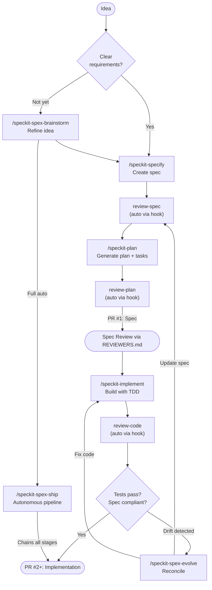

# cc-spex


[](https://github.com/obra/superpowers)
[](https://github.com/github/spec-kit)

> Extend Spec-Kit with composable extensions and workflow commands for Claude Code.

> [!IMPORTANT]
> Starting with v5.0.0, cc-spex uses spec-kit's native extension system. The old traits/overlay system has been removed. See [Migrating from v4.x](#migrating-from-v4x) below.

## Why cc-spex?

[Spec-Kit](https://github.com/github/spec-kit) is a great foundation for specification-driven development. cc-spex is a Claude Code plugin that extends Spec-Kit through **extensions**, self-contained bundles that provide additional commands and lifecycle hooks.

Five bundled extensions add quality gates, git worktree isolation, parallel agent execution, and multi-perspective code review. Each extension registers hooks that fire automatically at spec-kit lifecycle boundaries. You enable or disable them independently via `specify extension enable/disable`.

cc-spex also adds commands for things Spec-Kit doesn't cover: interactive brainstorming, spec/code drift detection, and autonomous pipelines. For hands-on work, you call each step yourself. For full automation, `/speckit-spex-ship` chains the entire workflow from brainstorm to verification with configurable oversight.

## Workflow

Specification-driven development works well as a solo practice: you write the spec, you implement it, you review your own code. The feedback loop is tight and the overhead is low. In a team setting, though, the approach hits friction. The spec, plan, and implementation together can produce thousands of lines of structured artifacts and code. A single PR containing all of that is difficult to review meaningfully. Reviewers either rubber-stamp it or spend hours trying to understand decisions that were made early in the process.

cc-spex addresses this with a two-phase workflow that splits specification from implementation into separate pull requests. The key insight: catch design problems during spec review, before any code exists, so that implementation PRs can focus on whether the code matches an already-agreed specification.

### Phase 1: Specification

Start with an idea, refine it through brainstorming, then create a formal spec and implementation plan.

```
/speckit-spex-brainstorm   # Refine the idea into a structured brainstorm document
/speckit-specify           # Create formal spec from brainstorm
/speckit-plan              # Generate implementation plan
/speckit-tasks             # Generate task breakdown
```

Quality gates fire automatically via `spex-gates` hooks: review-spec runs after specify, review-plan runs after tasks.

The output is a PR containing Spec-Kit artifacts (`spec.md`, `plan.md`, `tasks.md`) and a spex-generated `REVIEWERS.md` guide. That last file is what makes collaborative SDD practical.

#### The REVIEWERS.md Guide

Reviewing a 500-line specification document from scratch is daunting. `REVIEWERS.md` is generated by spex to make even medium to large PRs reviewable within 30 minutes. It highlights the decisions that actually need human judgment: architectural trade-offs, scope boundaries, areas where the AI made assumptions that a domain expert should validate. The guide also flags potentially controversial points, things where reasonable engineers might disagree, so reviewers can focus their time on the parts where their input matters most rather than reading everything end to end.

Open a PR with these artifacts. Reviewers follow `REVIEWERS.md` to understand the spec's scope, key decisions, and areas that need scrutiny.

### Phase 2: Implementation

After the spec PR is reviewed and merged, implementation can proceed in one or more PRs (one per logical phase is ideal). Each implementation PR updates `REVIEWERS.md` with code-specific review hints, compliance notes, and areas where the reviewer should focus.

```
/speckit-implement         # Build following the plan
```

Code review and verification run automatically via `spex-gates` hooks after implementation completes.

Because the spec is already reviewed and agreed, reviewers already understand the design. They can focus on whether the code correctly implements the spec rather than questioning the approach itself.

If spec/code drift is detected during implementation, use `/speckit-spex-evolve` to reconcile: either update the spec or fix the code, then continue.

### Context Management

**Start each spec-kit/spex session in a fresh Claude Code session.** The SDD workflow orchestration requires a non-fatigued context to be followed rigorously. Reusing a session that already has significant conversation history leads to the model taking shortcuts, skipping quality gates, or collapsing workflow steps. Open a new terminal or run `claude` fresh before starting a spec-kit workflow.

Similarly, do not accept shortcuts that Claude offers during the workflow. If the model suggests skipping a phase, combining steps, or bypassing a quality gate, decline. The phases exist for a reason: each one produces artifacts that downstream steps depend on.

Between phases (and between planning and implementation within a phase), running `/clear` gives each stage a fresh context window. This prevents context accumulation from degrading output quality and ensures reviewers evaluate code independently of implementation history.

When you run `/clear`, review commands automatically resolve the spec from the current git branch name, so no manual spec selection is needed. The `spex-gates` extension displays context clear recommendations at transition points.

In the `/speckit-spex-ship` pipeline, all review stages and the implementation stage run as isolated subagents automatically, so the orchestrator stays lightweight without manual `/clear` calls.

### One-Shot: `/speckit-spex-ship`

For smaller features or solo work where intermediate review is not needed, `/speckit-spex-ship` chains the entire workflow from brainstorm through verification in a single session. It runs all nine stages autonomously with configurable oversight levels (`--ask always|smart|never`) and can optionally create a PR at the end with `--create-pr`. See [Ship Command](#ship-command) below for details.



## Quick Start

**Prerequisites:**
1. [Claude Code](https://docs.anthropic.com/en/docs/claude-code) installed
2. [Spec-Kit](https://github.com/github/spec-kit) installed (`uv tool install specify-cli --from git+https://github.com/github/spec-kit.git` or see their docs)

**Install via Marketplace (recommended):**

```bash
# Add the marketplace (once)
/plugin marketplace add rhuss/cc-rhuss-marketplace

# Install the plugin
/plugin install spex@cc-rhuss-marketplace
```

**Install from source:**

```bash
git clone https://github.com/rhuss/cc-spex.git
cd cc-spex
make install
```

**Initialize your project:**

```
/spex:init
```

This runs Spec-Kit's `specify init`, installs all five bundled extensions, and asks about permissions. After initialization, extension hooks fire automatically at spec-kit lifecycle boundaries.

## The Extensions System

cc-spex uses spec-kit's native extension system. Each extension lives in `spex/extensions/<ext-id>/` with an `extension.yml` manifest, commands, and optional config files.

### Bundled Extensions

**`spex`** (core, always active): Brainstorming, ship pipeline, help, evolve, spec refactoring, and flow state tracking.

**`spex-gates`**: Quality gates that fire automatically via lifecycle hooks:
- `after_specify`: runs spec review
- `after_tasks`: runs plan review
- `after_implement`: runs code review and verification

**`spex-deep-review`** (requires `spex-gates`): Multi-perspective code review with five specialized agents (correctness, architecture, security, production readiness, test quality). Critical and Important findings trigger an autonomous fix loop (up to 3 rounds). Integrates with CodeRabbit CLI when available.

**`spex-teams`** (experimental, requires `spex-gates`): Parallel implementation via Claude Code Agent Teams. When combined with `spex-deep-review`, review agents run in parallel.

**`spex-worktrees`**: Git worktree isolation for feature development. After `/speckit-specify`, optionally creates a sibling worktree and copies `.claude/` and `.specify/` config to it.

### Managing Extensions

```bash
specify extension list                    # Show installed extensions and status
specify extension disable spex-teams      # Disable an extension
specify extension enable spex-teams       # Re-enable an extension
```

Extension state is tracked in `.specify/extensions/.registry`.

## Commands Reference

### Workflow Commands

These are the commands you'll use day-to-day. The `/speckit-*` commands come from Spec-Kit. Extension commands use the `/speckit-spex-*` prefix and are registered after `/spex:init`.

| Command | Purpose |
|---------|---------|
| `/speckit-specify` | Define requirements and create a formal spec |
| `/speckit-plan` | Generate an implementation plan from a spec |
| `/speckit-tasks` | Create actionable tasks from a plan |
| `/speckit-implement` | Build features following the plan and tasks |
| `/speckit-constitution` | Define project-wide governance principles |
| `/speckit-clarify` | Clarify underspecified areas of a spec |
| `/speckit-analyze` | Check consistency across spec artifacts |
| `/speckit-checklist` | Generate a quality validation checklist |
| `/speckit-taskstoissues` | Convert tasks to GitHub issues |

### Spex Extension Commands

These commands are provided by spex extensions and available after `/spex:init`.

| Command | Extension | Purpose |
|---------|-----------|---------|
| `/spex:init` | (plugin) | Initialize Spec-Kit, install extensions, configure permissions |
| `/speckit-spex-brainstorm` | spex | Refine a rough idea into a structured brainstorm document as input for `/speckit-specify` |
| `/speckit-spex-ship` | spex | Run the full workflow autonomously |
| `/speckit-spex-evolve` | spex | Reconcile spec/code drift with guided resolution |
| `/speckit-spex-help` | spex | Show a quick reference for all commands |
| `/speckit-spex-gates-review-spec` | spex-gates | Validate spec (fires automatically via hook) |
| `/speckit-spex-gates-review-plan` | spex-gates | Review plan (fires automatically via hook) |
| `/speckit-spex-gates-review-code` | spex-gates | Review code compliance (fires automatically via hook) |
| `/speckit-spex-gates-stamp` | spex-gates | Final gate before completion |
| `/speckit-spex-deep-review-review` | spex-deep-review | Multi-perspective code review with 5 agents |
| `/speckit-spex-worktrees-manage` | spex-worktrees | List, create, or clean up git worktrees |

## Ship Command

`/speckit-spex-ship` is the autonomous full-cycle workflow that chains all stages from specification through verification. It requires both the `spex-gates` and `spex-deep-review` extensions to be enabled.

```
/speckit-spex-ship [brainstorm-file] [--ask always|smart|never] [--resume] [--start-from <stage>] [--create-pr] [--no-external] [--[no-]coderabbit] [--[no-]copilot]
```

The pipeline runs nine stages in strict order:

| # | Stage | What happens |
|---|-------|-------------|
| 0 | specify | Generate spec from brainstorm document |
| 1 | clarify | Resolve spec ambiguities (up to 5 questions) |
| 2 | review-spec | Validate spec quality and structure |
| 3 | plan | Generate implementation plan with research |
| 4 | tasks | Generate dependency-ordered task breakdown |
| 5 | review-plan | Validate plan feasibility, create `REVIEWERS.md` |
| 6 | implement | Execute implementation following task plan |
| 7 | review-code | Spec compliance + deep-review agents + auto-fix loop |
| 8 | stamp | Final gate (tests, hygiene, drift check) |

**Oversight levels** control how findings are handled:

| Level | Unambiguous fixes | Ambiguous fixes | Blockers |
|-------|-------------------|-----------------|----------|
| `always` | Pause for approval | Pause | Pause |
| `smart` (default) | Auto-fix | Pause | Pause |
| `never` | Auto-fix | Auto-fix | Pause |

Pipeline state is persisted to `.specify/.spex-state`, so interrupted runs can be resumed with `--resume`. Use `--start-from <stage>` to begin at a specific stage when artifacts from earlier stages already exist.

### Recommended setup with worktrees

The `spex-worktrees` extension can interfere with `/speckit-spex-ship` because worktree creation during `specify` requires a session restart. Disable it when using ship:

```bash
specify extension disable spex-worktrees
```

Instead, create a worktree manually before starting the pipeline:

```bash
git worktree add ../myproject-new-feature main
cd ../myproject-new-feature
```

Then start your workflow there:

```
/speckit-spex-brainstorm          # Capture the idea
/speckit-spex-ship --ask smart    # Run the full pipeline
```

During the `specify` stage, Spec-Kit creates a feature-specific branch (e.g., `feature/012-auth-redesign`) and the pipeline continues on that branch through implementation and verification. Since the worktree is isolated, nothing interrupts your main workspace.

When the pipeline finishes, you can either rename the worktree directory to match the feature branch, or merge and remove it:

```bash
# Option A: Rename to match the branch
cd ..
mv myproject-new-feature myproject-auth-redesign

# Option B: Merge and clean up
cd ../myproject
git merge feature/012-auth-redesign
git worktree remove ../myproject-new-feature
```

## Deep Review

The deep-review process is a two-stage code review pipeline that runs automatically when the `spex-deep-review` extension is enabled (via the `after_implement` hook).

**Stage 1: Spec Compliance.** The code is checked against functional and non-functional requirements from the spec. If the compliance score is below 95%, the pipeline stops and reports gaps before proceeding.

**Stage 2: Multi-Perspective Review.** Five specialized agents analyze the codebase, each focused on a distinct concern:

| Agent | Focus |
|-------|-------|
| **Correctness** | Mutation safety, shared references, logic errors, resource cleanup, null safety |
| **Architecture & Idioms** | Dead code, unnecessary complexity, duplication, misleading naming, YAGNI violations |
| **Security** | Input validation, injection risks, secret handling, authentication, RBAC scope |
| **Production Readiness** | Goroutine leaks, unbounded channels, memory patterns, observability gaps, graceful shutdown |
| **Test Quality** | Coverage gaps, weak assertions, wrong-reason passes, missing edge cases, test isolation |

When the `spex-teams` extension is also enabled, all five agents run in parallel via Claude Code Agent Teams. Otherwise they run sequentially.

**Autonomous Fix Loop.** After all agents report their findings, Critical and Important issues are collected and fixed automatically (up to 3 rounds). Each round applies fixes and re-reviews only the modified files. The loop ends when no Critical or Important findings remain, or when the maximum rounds are reached.

**Output.** The process produces two artifacts:
- `review-findings.md` with detailed findings including severity, confidence, file/line, and resolution status
- An appended section in `REVIEWERS.md` summarizing what was found, what was fixed automatically, and what still needs human attention

## Migrating from v4.x

If you were using the traits-based v4.x, follow these steps:

**1. Update the plugin:**

```bash
cd cc-spex
git pull
make install
```

**2. Migrate project config:**

Run `/spex:init` in each project. Extensions are installed automatically. If `.specify/spex-traits.json` exists, a warning is printed (the old config is no longer used).

**3. Update command references:**

| Before (v4.x) | After (v5.x) |
|----------------|--------------|
| `/spex:brainstorm` | `/speckit-spex-brainstorm` |
| `/spex:ship` | `/speckit-spex-ship` |
| `/spex:review-spec` | `/speckit-spex-gates-review-spec` (or automatic via hook) |
| `/spex:review-code` | `/speckit-spex-gates-review-code` (or automatic via hook) |
| `/spex:review-plan` | `/speckit-spex-gates-review-plan` (or automatic via hook) |
| `/spex:evolve` | `/speckit-spex-evolve` |
| `/spex:stamp` | `/speckit-spex-gates-stamp` |
| `/spex:worktree` | `/speckit-spex-worktrees-manage` |
| `/spex:traits enable X` | `specify extension enable X` |
| `/spex:traits disable X` | `specify extension disable X` |
| `.specify/spex-traits.json` | `.specify/extensions/.registry` |

All `/speckit-*` commands remain unchanged.

## Migrating from sdd (v2.x)

If you were using the previous `sdd` plugin, follow these steps:

**1. Update the plugin:**

```bash
cd cc-spex       # (formerly cc-sdd)
git pull
make install     # automatically removes old sdd plugin and marketplace
```

**2. Migrate project config:**

Run `/spex:init` in each project. This automatically renames `.specify/sdd-traits.json` to `spex-traits.json` and `.specify/.sdd-phase` to `.spex-phase`.

**3. Update references:**

| Before (v2.x) | After (v3.x) |
|----------------|--------------|
| `/sdd:brainstorm` | `/spex:brainstorm` |
| `/sdd:review-spec` | `/spex:review-spec` |
| `/sdd:evolve` | `/spex:evolve` |
| `/sdd:init` | `/spex:init` |
| `/sdd:traits` | `/spex:traits` |
| `.specify/sdd-traits.json` | `.specify/spex-traits.json` |

All `/speckit-*` commands remain unchanged.

## Development

```bash
make validate          # Validate plugin and marketplace schemas
make test-install      # Integration test: install from local marketplace
make test-install-remote  # Integration test: install from GitHub marketplace
make release           # Pre-release checks (validate + test-install), then prints the release command
```

The release process:

1. Update the version in `.claude-plugin/marketplace.json`
2. Run `make release` to validate and run the full integration test
3. If all checks pass, run the printed `gh release create` command
4. Update the version in `cc-rhuss-marketplace` to match

## Acknowledgements

cc-spex builds on two projects:

- **[Superpowers](https://github.com/obra/superpowers)** by Jesse Vincent, which provides quality gates and verification workflows for Claude Code.
- **[Spec-Kit](https://github.com/github/spec-kit)** by GitHub, which provides specification-driven development templates and the `specify` CLI.

## License

Apache License 2.0. See [LICENSE](LICENSE) for details.
