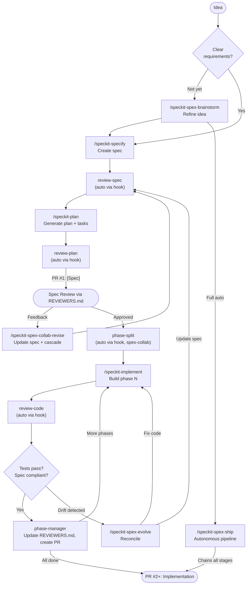

# cc-spex


[](https://github.com/obra/superpowers)
[](https://github.com/github/spec-kit)

> Extend Spec-Kit with composable extensions and workflow commands for Claude Code.

> [!CAUTION]
> The `main` branch is tracking **v6.0.0 development**, which introduces agent-harness-agnostic spex. Version 6 works with Claude Code, Codex, OpenCode, and any platform that spec-kit supports. This is a work in progress and not yet stable. For the latest stable release, use the [`5.9.x`](https://github.com/rhuss/cc-spex/tree/5.9.x) branch. See [Migrating from v5.x to v6.x](#migrating-from-v5x-to-v6x) for upgrade guidance.

## Why cc-spex?

[Spec-Kit](https://github.com/github/spec-kit) is a great foundation for specification-driven development. cc-spex is a Claude Code plugin that extends Spec-Kit through **extensions**, self-contained bundles that provide additional commands and lifecycle hooks.

Six bundled extensions add quality gates, git worktree isolation, parallel agent execution, multi-perspective code review, and collaborative PR workflows. Each extension registers hooks that fire automatically at spec-kit lifecycle boundaries. You enable or disable them independently via `specify extension enable/disable`.

cc-spex also adds commands for things Spec-Kit doesn't cover: interactive brainstorming, spec/code drift detection, and autonomous pipelines. For hands-on work, you call each step yourself. For full automation, `/speckit-spex-ship` chains the entire workflow from brainstorm to verification with configurable oversight.

## Workflow

Specification-driven development works well as a solo practice: you write the spec, you implement it, you review your own code. The feedback loop is tight and the overhead is low. In a team setting, though, the approach hits friction. The spec, plan, and implementation together can produce thousands of lines of structured artifacts and code. A single PR containing all of that is difficult to review meaningfully. Reviewers either rubber-stamp it or spend hours trying to understand decisions that were made early in the process.

cc-spex addresses this with a two-phase workflow that separates specification from implementation. The key insight: catch design problems during spec review, before any code exists, so that implementation review can focus on whether the code matches an already-agreed specification.

The two phases can live in **separate PRs** (spec PR first, implementation PR second) or on the **same PR** (spec committed first, implementation added after approval). Labels track which phase the PR is in. The `spex-collab` extension must be enabled for the collaborative workflow features described below (`specify extension enable spex-collab`).

### Phase 1: Specification

Start with an idea, refine it through brainstorming, then create a formal spec and implementation plan.

```
/speckit-spex-brainstorm   # Refine the idea into a structured brainstorm document
/speckit-specify           # Create formal spec from brainstorm
/speckit-plan              # Generate implementation plan
/speckit-tasks             # Generate task breakdown
```

Quality gates fire automatically via `spex-gates` hooks: review-spec runs after specify, review-plan runs after tasks. With `spex-collab` enabled, `REVIEWERS.md` is generated automatically after task generation as the single reviewer-facing artifact. The reviewers command offers to create a `[Spec]` PR automatically after generating REVIEWERS.md.

#### The REVIEWERS.md Guide

Reviewing a 500-line specification document from scratch is daunting. `REVIEWERS.md` is generated by spex to make even medium to large PRs reviewable within 30 minutes. It follows a question-driven structure: Why (the problem), What (outcome-level summary), How (implementation approach from plan.md), When (applicability and scope), then the design decisions that need human judgment and areas of concern.

All PRs created by spex include a link to the Review Guide at the top of the PR description, using full GitHub URLs that work across forks.

Open a PR with these artifacts. Reviewers follow `REVIEWERS.md` to understand the spec's scope, key decisions, and areas that need scrutiny.

#### PR Title Conventions

spex uses structured PR titles to communicate the content at a glance:

| Stage | Title format | Example |
|-------|-------------|---------|
| Spec only | `Feature Name [Spec]` | `Structured events [Spec]` |
| Spec + implementation | `Feature Name [Spec + Impl]` | `Structured events [Spec + Impl]` |
| Multi-phase | `Feature Name [Spec + Impl (N/T)]` | `Structured events [Spec + Impl (1/3)]` |

#### PR Labels

Labels track the current phase of a PR, especially useful when spec and implementation live on the same PR. They are applied automatically by collab commands and updated as the PR progresses:

| Label | Applied when | Meaning |
|-------|-------------|---------|
| `spex/spec` | Spec PR created | Spec is under review, not yet approved |
| `spex/spec-approved` | Spec approved, implementation starting | Replaces `spex/spec` after review approval |
| `spex/implement` | Implementation added | Code is being implemented against the approved spec |

Labels are configurable in `.specify/extensions/spex-collab/collab-config.yml` and can be disabled entirely for repos that don't have them.

#### Spec Revision Loop

When a `[Spec]` PR receives review comments, the revision workflow handles the feedback without manual artifact juggling:

```
/speckit-spex-collab-revise --pr 42     # Read PR comments, update spec, cascade
```

This updates `spec.md` based on the feedback, re-runs `/speckit-clarify` and quality gates (review-spec, review-plan), regenerates `plan.md` and `tasks.md`, appends a revision history entry to `REVIEWERS.md`, commits, pushes, and posts a summary comment on the PR.

If implementation was already started in parallel (before the spec PR was approved), the revised tasks may conflict with existing code:

```
/speckit-spex-collab-reconcile          # Scan code against revised tasks
/speckit-implement                      # Pick up only the delta
```

The reconcile command classifies each task as DONE (existing code satisfies it), REWORK (code exists but needs changes per revised spec), or NEW (added by revision). It marks DONE tasks as `[X]` and annotates REWORK tasks with hints, so `/speckit-implement` picks up only the remaining work.

### Phase 2: Implementation

After the spec is approved, implementation can proceed. Two patterns are supported:

**Same PR** (recommended for smaller scopes): Keep spec and implementation on the same PR. After spec approval, the `spex/spec` label is replaced with `spex/spec-approved`, then `spex/implement` is added when implementation begins. The PR title updates from `[Spec]` to `[Spec + Impl]`. Reviewers can see the full history in one place.

**Separate PRs** (for larger scopes): Merge the spec PR first, then create one or more implementation PRs. Each implementation PR references the approved spec via `REVIEWERS.md`.

With `spex-collab` enabled, a phase split proposal is presented before implementation begins (via the `before_implement` hook). You confirm or adjust how tasks.md phases map to PRs, then implementation pauses after each phase. At each pause, the `phase-manager` command runs code review, updates `REVIEWERS.md` with code-specific review hints, and offers to create a PR via `gh`.

```
/speckit-implement                        # Starts with phase split proposal
/speckit-spex-collab-phase-manager        # After each phase: review, PR, pause
```

Without `spex-collab`, implementation runs straight through and code review fires automatically via `spex-gates` hooks after completion.

Because the spec is already reviewed and agreed, reviewers already understand the design. They can focus on whether the code correctly implements the spec rather than questioning the approach itself.

If spec/code drift is detected during implementation, use `/speckit-spex-evolve` to reconcile: either update the spec or fix the code, then continue.

### Context Management

**Start each spec-kit/spex session in a fresh Claude Code session.** The SDD workflow orchestration requires a non-fatigued context to be followed rigorously. Reusing a session that already has significant conversation history leads to the model taking shortcuts, skipping quality gates, or collapsing workflow steps. Open a new terminal or run `claude` fresh before starting a spec-kit workflow.

Similarly, do not accept shortcuts that Claude offers during the workflow. If the model suggests skipping a phase, combining steps, or bypassing a quality gate, decline. The phases exist for a reason: each one produces artifacts that downstream steps depend on.

Between phases (and between planning and implementation within a phase), running `/clear` gives each stage a fresh context window. This prevents context accumulation from degrading output quality and ensures reviewers evaluate code independently of implementation history.

When you run `/clear`, review commands automatically resolve the spec from the current git branch name, so no manual spec selection is needed. The `spex-gates` extension displays context clear recommendations at transition points.

In the `/speckit-spex-ship` pipeline, all review stages and the implementation stage run as isolated subagents automatically, so the orchestrator stays lightweight without manual `/clear` calls.

### One-Shot: `/speckit-spex-ship`

For smaller features or solo work where intermediate review is not needed, `/speckit-spex-ship` chains the entire workflow from brainstorm through verification in a single session. It runs all nine stages autonomously with configurable oversight levels (`--ask always|smart|never`). At completion, it presents a choice: submit a PR, merge directly to main, or stop for manual handling. See [Ship Command](#ship-command) below for details.



## Quick Start

**Prerequisites:**
1. [Claude Code](https://docs.anthropic.com/en/docs/claude-code) installed
2. [Spec-Kit](https://github.com/github/spec-kit) installed (`uv tool install specify-cli --from git+https://github.com/github/spec-kit.git` or see their docs)

**Install via Marketplace (recommended):**

```bash
# Add the marketplace (once)
/plugin marketplace add rhuss/cc-rhuss-marketplace

# Install the plugin
/plugin install spex@cc-rhuss-marketplace
```

**Install from source:**

```bash
git clone https://github.com/rhuss/cc-spex.git
cd cc-spex
make install
```

**Initialize your project:**

```
/spex:init
```

This runs Spec-Kit's `specify init`, installs seven bundled extensions (six enabled by default, spex-detach opt-in), and configures permissions. After initialization, extension hooks fire automatically at spec-kit lifecycle boundaries.

### Workflow-Based Setup (6.x)

In spex 6.0, a spec-kit setup workflow replaces the plugin-based init as the primary install path. The workflow is harness-agnostic (Claude Code, Codex, OpenCode) and executable from a single command:

```bash
# Install from GitHub release URL (no clone needed)
specify workflow run https://github.com/rhuss/cc-spex/releases/latest/download/setup.yml

# Customize with inputs
specify workflow run spex/setup.yml -i "extensions=spex-gates,spex-worktrees"
specify workflow run spex/setup.yml -i "permissions=yolo"
specify workflow run spex/setup.yml -i "integration=codex"
```

The workflow auto-detects the agent harness, installs extensions, and applies per-agent configuration. Prerequisites: `specify` CLI (>= 0.7.4), `git`, and `jq`. The existing Claude Code plugin will delegate to this workflow when available, falling back to direct init otherwise.

## The Extensions System

cc-spex uses spec-kit's native extension system. Each extension lives in `spex/extensions/<ext-id>/` with an `extension.yml` manifest, commands, and optional config files.

### Bundled Extensions

**`spex`** (core, always active): Brainstorming, ship pipeline, help, evolve, spec refactoring, flow state tracking, focused interactive smoke test (curated scenarios from spec's `## Smoke Test` section), submit (PR creation + watch mode), finish (smoke test gate + squash + merge), and lifecycle hooks (flow state cleanup via `after_finish`).

**`spex-gates`**: Quality gates that fire automatically via lifecycle hooks:
- `after_specify`: runs spec review
- `after_tasks`: runs plan review
- `after_implement`: runs code review and verification

**`spex-deep-review`** (requires `spex-gates`): Multi-perspective code review with five specialized agents (correctness, architecture, security, production readiness, test quality). Critical and Important findings trigger an autonomous fix loop (up to 3 rounds). Integrates with CodeRabbit CLI when available.

**`spex-teams`** (experimental, requires `spex-gates`): Parallel implementation via Claude Code Agent Teams. When combined with `spex-deep-review`, review agents run in parallel.

**`spex-worktrees`**: Git worktree isolation for feature development. After `/speckit-specify`, creates a worktree at `.claude/worktrees/<branch>` (inside the project directory) and copies `.claude/` and `.specify/` config to it. This default location keeps CWD stable across Claude Code subagent returns. Projects can override `base_path` in `worktree-config.yml` for external worktrees.

**`spex-collab`** (requires `spex-gates`): Collaborative PR workflows for team-based spec-driven development. Generates `REVIEWERS.md` review guides that help PR reviewers complete reviews within 30 minutes, and manages implementation phases with pause points between them.

**`spex-detach`** (opt-in): Detach spec artifacts at PR time for contributing to upstream projects that don't use spec-driven development. At finish time, creates a clean PR branch (`pr/<feature-branch>`) containing only code changes by computing a filtered diff against the upstream default branch's merge-base. Optionally archives spec artifacts to a configured project-specs repo. When enabled with an archive path, brainstorm documents are written to the project-specs repo instead of the code worktree.
- `after_tasks`: generates `REVIEWERS.md` with spec PR review guidance, offers to create a `[Spec]` PR
- `before_implement`: presents phase split proposal for implementation PRs
- `phase-manager`: coordinates PR creation, code review updates, and phase boundaries. After spec PR creation, suggests triage with a `/loop` command and delay notice. After spec triage completes, runs a gate check comparing review comment count against `triage.split_threshold` (default 100) to recommend continuing on the same PR or splitting into separate implementation PR(s). After implementation push, suggests triage (with deep-review first if that extension is enabled).
- `revise`: handles spec revision from PR review feedback, cascades to plan/tasks, runs quality gates, documents changes in revision history
- `reconcile`: after spec revision, scans existing implementation against revised tasks, classifies each as DONE/REWORK/NEW, and produces a delta for re-implementation
- `triage`: autonomously handles bot review comments (assess, apply fixes, reject with justification, reply), then interactively presents human comments for approval. Supports loop mode for continuous triage and spec-aware assessment. The triage lifecycle is integrated into the flow state with `triage-spec` and `triage-impl` phases, visible in the status line as a `T` badge.

### Managing Extensions

```bash
specify extension list                    # Show installed extensions and status
specify extension disable spex-teams      # Disable an extension
specify extension enable spex-teams       # Re-enable an extension
```

Extension state is tracked in `.specify/extensions/.registry`.

## Commands Reference

### Workflow Commands

These are the commands you'll use day-to-day. The `/speckit-*` commands come from Spec-Kit. Extension commands use the `/speckit-spex-*` prefix and are registered after `/spex:init`.

| Command | Purpose |
|---------|---------|
| `/speckit-specify` | Define requirements and create a formal spec |
| `/speckit-plan` | Generate an implementation plan from a spec |
| `/speckit-tasks` | Create actionable tasks from a plan |
| `/speckit-implement` | Build features following the plan and tasks |
| `/speckit-constitution` | Define project-wide governance principles |
| `/speckit-clarify` | Clarify underspecified areas of a spec |
| `/speckit-analyze` | Check consistency across spec artifacts |
| `/speckit-checklist` | Generate a quality validation checklist |
| `/speckit-taskstoissues` | Convert tasks to GitHub issues |

### Spex Extension Commands

These commands are provided by spex extensions and available after `/spex:init`.

| Command | Extension | Purpose |
|---------|-----------|---------|
| `/spex:init` | (plugin) | Initialize Spec-Kit, install extensions, configure permissions (6.x: delegates to setup workflow) |
| `/speckit-spex-brainstorm` | spex | Refine a rough idea into a structured brainstorm document as input for `/speckit-specify` |
| `/speckit-spex-ship` | spex | Run the full workflow autonomously |
| `/speckit-spex-evolve` | spex | Reconcile spec/code drift with guided resolution |
| `/speckit-spex-clear` | spex | Clear stuck state, dismiss status line |
| `/speckit-spex-help` | spex | Show a quick reference for all commands |
| `/speckit-spex-gates-review-spec` | spex-gates | Validate spec (fires automatically via hook) |
| `/speckit-spex-gates-review-plan` | spex-gates | Review plan (fires automatically via hook) |
| `/speckit-spex-gates-review-code` | spex-gates | Review code compliance (fires automatically via hook) |
| `/speckit-spex-smoke-test` | spex | Focused interactive smoke test from spec's `## Smoke Test` section. Claude automates setup/execution, human provides pass/fail judgment. Auto-skips when section absent. Writes SMOKE-TEST.md report. Always interactive, even in ship pipeline |
| `/speckit-spex-submit` | spex | Push and create PR for team review. Runs verification, commits outstanding changes, creates PR with spec-linked body and REVIEWERS.md. `--watch`: monitor CI, auto-fix failures, triage review comments |
| `/speckit-spex-finish` | spex | Smoke test + squash + merge/keep (land the code). Runs smoke test gate, squashes commits with conventional commit message, merges or keeps. `--no-smoke-test`: skip the smoke test gate |
| `/speckit-spex-gates-stamp` | spex-gates | Verification only (use finish for full flow) |
| `/speckit-spex-deep-review-review` | spex-deep-review | Multi-perspective code review with 5 agents |
| `/speckit-spex-worktrees-manage` | spex-worktrees | List, create, or clean up git worktrees |
| `/speckit-spex-collab-reviewers` | spex-collab | Generate REVIEWERS.md review guide, offer `[Spec]` PR (fires automatically via hook) |
| `/speckit-spex-collab-phase-split` | spex-collab | Present phase split proposal before implementation |
| `/speckit-spex-collab-phase-manager` | spex-collab | Manage phase boundaries, PR creation, and REVIEWERS.md updates |
| `/speckit-spex-collab-revise` | spex-collab | Revise spec from PR review feedback, cascade to plan/tasks, update REVIEWERS.md |
| `/speckit-spex-collab-reconcile` | spex-collab | Reconcile revised tasks against existing implementation, produce delta |
| `/speckit-spex-collab-triage` | spex-collab | Triage PR review comments: handle bot suggestions autonomously, review human comments interactively |
| `/speckit-spex-detach-detach` | spex-detach | Create clean PR branch, archive specs, or resolve brainstorm context |

## Ship Command

`/speckit-spex-ship` is the autonomous full-cycle workflow that chains all stages from specification through verification. It requires both the `spex-gates` and `spex-deep-review` extensions to be enabled.

```
/speckit-spex-ship [brainstorm-file] [--ask always|smart|never] [--resume] [--start-from <stage>] [--no-external] [--[no-]coderabbit] [--[no-]copilot]
```

The pipeline runs nine stages in strict order:

| # | Stage | What happens |
|---|-------|-------------|
| 0 | specify | Generate spec from brainstorm document |
| 1 | clarify | Resolve spec ambiguities (up to 5 questions) |
| 2 | review-spec | Validate spec quality and structure |
| 3 | plan | Generate implementation plan with research |
| 4 | tasks | Generate dependency-ordered task breakdown |
| 5 | review-plan | Validate plan feasibility, create `REVIEWERS.md` |
| 6 | implement | Execute implementation following task plan (with per-task test checkpoints) |
| 7 | review-code | Spec compliance + deep-review agents + auto-fix loop |
| 8 | completion | End-of-pipeline choice: submit PR (`/speckit-spex-submit`), merge directly (`/speckit-spex-finish`), or stop here for manual handling |

**Oversight levels** control how findings are handled:

| Level | Unambiguous fixes | Ambiguous fixes | Blockers |
|-------|-------------------|-----------------|----------|
| `always` | Pause for approval | Pause | Pause |
| `smart` (default) | Auto-fix | Pause | Pause |
| `never` | Auto-fix | Auto-fix | Pause |

Pipeline state is persisted to `.specify/.spex-state`, so interrupted runs can be resumed with `--resume`. Use `--start-from <stage>` to begin at a specific stage when artifacts from earlier stages already exist.

### Backpressure loops

The ship pipeline includes two automated feedback mechanisms that catch problems early:

**Per-task test checkpoints** (Stage 6): After completing each task during implementation, the test suite runs automatically. If tests fail, the agent attempts to fix the regression before moving to the next task (max 2 attempts). This prevents compounding breakage where tasks 3-5 build on a broken foundation from task 2. Disable with `implement.test_between_tasks: false` in `.specify/extensions/spex/spex-config.yml`.

**Mid-implementation review checkpoints** (Stage 6): When `spex-deep-review` is enabled and a feature has 3 or more tasks, fresh-context correctness review agents are spawned at the 1/3 and 2/3 task completion marks. Each checkpoint reviews all code so far against the spec, focusing only on correctness (not architecture, security, or test quality). Findings are fixed before implementation continues, preventing drift from compounding across the remaining tasks. Checkpoint results are recorded in the state file so the final deep review can show a layer comparison of what each review layer caught. Disable with `implement.review_checkpoints: false` in `.specify/extensions/spex/spex-config.yml`.

**Post-PR watch mode** (`/speckit-spex-submit --watch`): After creating a PR, watch mode polls CI status, reads failure logs, and attempts fixes within the PR's changed file set (max 2 attempts). If `spex-collab` is enabled, watch mode also triages new review comments via `/speckit-spex-collab-triage`. Watch mode exits on CI success, timeout (default 30 minutes), or when the PR is closed/merged externally. Configure timeouts and intervals in `.specify/extensions/spex/spex-config.yml` under `watch.timeout_minutes` and `watch.poll_interval_seconds`.

### Worktree integration

When the `spex-worktrees` extension is enabled, the ship pipeline automatically creates a worktree at `.claude/worktrees/<branch>` during Stage 0 (specify) and continues the pipeline there. Your main workspace stays on `main`, free for other work while ship runs in the worktree. The inside-project location ensures CWD persists across Claude Code subagent returns.

After the pipeline completes, you choose what to do:

- **Submit PR**: run `/speckit-spex-submit` to push and create a PR for team review
- **Merge directly**: run `/speckit-spex-finish` to smoke test, squash, and merge to main
- **Test first**: leaves everything as-is for manual testing

If worktrees are not enabled, the pipeline works in-place on the feature branch (existing behavior).

## Deep Review

The deep-review process is a two-stage code review pipeline that runs automatically when the `spex-deep-review` extension is enabled (via the `after_implement` hook).

**Stage 1: Spec Compliance.** The code is checked against functional and non-functional requirements from the spec. If the compliance score is below 95%, the pipeline stops and reports gaps before proceeding.

**Stage 2: Multi-Perspective Review.** Five specialized agents analyze the codebase, each focused on a distinct concern:

| Agent | Focus |
|-------|-------|
| **Correctness** | Mutation safety, shared references, logic errors, resource cleanup, null safety |
| **Architecture & Idioms** | Dead code, unnecessary complexity, duplication, misleading naming, YAGNI violations |
| **Security** | Input validation, injection risks, secret handling, authentication, RBAC scope |
| **Production Readiness** | Goroutine leaks, unbounded channels, memory patterns, observability gaps, graceful shutdown |
| **Test Quality** | Coverage gaps, weak assertions, wrong-reason passes, missing edge cases, test isolation |

When the `spex-teams` extension is also enabled, all five agents run in parallel via Claude Code Agent Teams. Otherwise they run sequentially.

**Autonomous Fix Loop.** After all agents report their findings, Critical and Important issues are collected and fixed automatically (up to 3 rounds). Each round applies fixes and re-reviews only the modified files. The loop ends when no Critical or Important findings remain, or when the maximum rounds are reached.

**Agent Leaderboard.** After every deep review run, a per-agent statistics summary is displayed showing findings found, fixed, and remaining for each agent, plus a total row. The agent with the most findings is highlighted as MVP. In ship mode with checkpoints enabled, a layer comparison table shows what each review layer (checkpoint 1/3, checkpoint 2/3, final review) caught, including unique findings per layer.

**Output.** The process produces two artifacts:
- `review-findings.md` with detailed findings including severity, confidence, file/line, and resolution status
- An appended section in `REVIEWERS.md` summarizing what was found, what was fixed automatically, and what still needs human attention

## Idea Inbox

Code reviews regularly surface design-level observations that are valid but out of scope for the current PR. These ideas typically get lost in resolved comment threads or forgotten after the PR merges. The **idea inbox** (`brainstorm/idea-inbox.md`) captures them persistently so they can seed future brainstorm sessions.

### How Ideas Enter the Inbox

Ideas flow into the inbox from three sources, two automatic and one manual:

**Triage thematic clustering (automatic, user-gated).** When `/speckit-spex-collab-triage` processes PR review comments, Step 15 groups deferred and rejected findings by theme. When any theme has 2 or more findings (regardless of whether they were deferred or rejected), those themes are offered for capture. The user selects which themes to save via a multi-select prompt; unselected themes are discarded. Each selected theme becomes one inbox entry with the findings synthesized into a summary.

**Deep review Notable verdict (automatic).** The 5 deep review agents can classify design-level observations as "Notable" alongside the existing Critical, Important, and Minor severities. Notable findings are not bugs: they do not trigger the fix loop, do not affect the gate check, and do not block the review. They capture things like "this interface will need to evolve for the next phase" or "this pattern works now but won't scale under concurrent access." Notable findings appear in a dedicated "Notable Observations" section of `review-findings.md` and are automatically appended to the idea inbox without user confirmation.

**Manual addition.** Add entries to `brainstorm/idea-inbox.md` directly. This is useful after conversational code reviews where ideas surfaced in discussion but no triage or deep review was running. Use the entry format shown below.

### Entry Format

Each inbox entry follows this structure:

```markdown
### theme-slug

- **Source**: triage | deep-review | conversation
- **Date**: 2026-06-29
- **Reference**: #42
- **Summary**: Brief description of the idea

> Relevant excerpt from the review finding or discussion
```

The theme slug is a kebab-case identifier (2-4 words, under 40 characters) that captures the core concept. The file starts with a `# Idea Inbox` header. Entries are appended at the end. The `brainstorm/` directory and inbox file are created automatically on first write.

### How the Inbox Is Drained

The inbox is consumed by `/speckit-spex-brainstorm`. When you start a brainstorm session, the skill checks the inbox before its normal flow:

1. If inbox entries exist, they are presented grouped by theme as a multi-select prompt
2. You select which ideas to explore, or choose "Start fresh" to skip all
3. Selected items pre-fill the brainstorm session's problem framing with the entry's summary and context
4. After the brainstorm session completes with an `active` decision, consumed entries are removed from the inbox
5. If the session is parked or abandoned, inbox entries remain untouched for future sessions

Items that are never selected simply stay in the inbox until you choose them or manually remove them. There is no automatic expiry or cleanup.

### Quick Reference

| Action | How |
|--------|-----|
| See what's in the inbox | `cat brainstorm/idea-inbox.md` |
| Add an idea manually | Append an entry using the format above |
| Explore inbox ideas | `/speckit-spex-brainstorm` (offers inbox items as seeds) |
| Remove an idea without brainstorming | Edit the file and delete the `### theme-slug` block |
| Drain all ideas | Run `/speckit-spex-brainstorm` repeatedly, selecting items each time |

## Multi-Agent Support

spex supports multiple AI coding agents beyond Claude Code. The enforcement model adapts to each agent's hook API and available tools.

### Supported Agents

| Agent | Tool Gating | Prompt Interception | Interactive Prompts | Parallel Dispatch |
|-------|------------|--------------------|--------------------|------------------|
| **Claude Code** | PreToolUse hooks | UserPromptSubmit hooks | AskUserQuestion | Agent tool (teams) |
| **Codex CLI** | PreToolUse hooks | UserPromptSubmit hooks | Inline numbered list | Subagents |
| **OpenCode** | TypeScript plugin | Skill preambles | question tool | Task tool |

### Architecture

Enforcement logic is extracted into shared POSIX shell functions (`spex/scripts/hooks/shared/`). Per-agent adapters (`spex/scripts/adapters/{agent}/`) call the shared functions and format responses for each agent's hook API. This keeps enforcement behavior identical across agents while adapting to different hook contracts.

Agent detection follows this priority: (1) agent-specific environment variables, (2) agent directory presence (`.claude/`, `.codex/`, `.opencode/`), (3) `--ai` value from `.specify/init-options.json`.

### Graceful Degradation

Extensions degrade gracefully on agents with fewer capabilities:

| Extension | Claude Code | Codex / OpenCode |
|-----------|------------|-----------------|
| spex-gates | Full enforcement | Full enforcement |
| spex-collab | Full functionality | Full functionality |
| spex-teams | Parallel via Agent Teams | Sequential fallback |
| spex-worktrees | EnterWorktree tool | Manual git worktree commands |
| spex-deep-review | Parallel 5-agent review | Sequential single-session review |

## Migrating from v5.x to v6.x

Version 6 replaces the Claude Code plugin-based initialization with spec-kit's workflow system, making spex agent-harness-agnostic. The same setup works across Claude Code, Codex, OpenCode, and any future platform that spec-kit supports.

**1. Update the plugin:**

```bash
cd cc-spex
git checkout main
git pull
make install
```

**2. Re-initialize your projects:**

The `/spex:init` command still works but now delegates to a spec-kit setup workflow. You can also run the workflow directly, which is the recommended path for non-Claude-Code agents:

```bash
# Via spec-kit workflow (works on any agent)
specify workflow run https://github.com/rhuss/cc-spex/releases/latest/download/setup.yml

# Via Claude Code plugin (delegates to workflow internally)
/spex:init
```

**3. Key changes:**

| Area | v5.x | v6.x |
|------|------|------|
| Initialization | `/spex:init` (Claude Code plugin) | `specify workflow run setup.yml` (any agent) or `/spex:init` (delegates to workflow) |
| Agent support | Claude Code only | Claude Code, Codex, OpenCode, any spec-kit-supported agent |
| Extension scripts | Plugin-bundled | Extension-local (`spex/extensions/*/scripts/`) |
| Hook adapters | Claude Code hooks only | Shared POSIX functions with per-agent adapters |

Extensions, commands, and the spec-driven workflow itself are unchanged. If you have existing `.specify/` project configuration, it carries over without modification.

## Migrating from v4.x

If you were using the traits-based v4.x, follow these steps:

**1. Update the plugin:**

```bash
cd cc-spex
git pull
make install
```

**2. Migrate project config:**

Run `/spex:init` in each project. Extensions are installed automatically. If `.specify/spex-traits.json` exists, a warning is printed (the old config is no longer used).

**3. Update command references:**

| Before (v4.x) | After (v5.x) |
|----------------|--------------|
| `/spex:brainstorm` | `/speckit-spex-brainstorm` |
| `/spex:ship` | `/speckit-spex-ship` |
| `/spex:review-spec` | `/speckit-spex-gates-review-spec` (or automatic via hook) |
| `/spex:review-code` | `/speckit-spex-gates-review-code` (or automatic via hook) |
| `/spex:review-plan` | `/speckit-spex-gates-review-plan` (or automatic via hook) |
| `/spex:evolve` | `/speckit-spex-evolve` |
| `/spex:stamp` | `/speckit-spex-gates-stamp` |
| `/spex:worktree` | `/speckit-spex-worktrees-manage` |
| `/spex:traits enable X` | `specify extension enable X` |
| `/spex:traits disable X` | `specify extension disable X` |
| `.specify/spex-traits.json` | `.specify/extensions/.registry` |

All `/speckit-*` commands remain unchanged.

## Migrating from sdd (v2.x)

If you were using the previous `sdd` plugin, follow these steps:

**1. Update the plugin:**

```bash
cd cc-spex       # (formerly cc-sdd)
git pull
make install     # automatically removes old sdd plugin and marketplace
```

**2. Migrate project config:**

Run `/spex:init` in each project. This automatically renames `.specify/sdd-traits.json` to `spex-traits.json` and `.specify/.sdd-phase` to `.spex-phase`.

**3. Update references:**

| Before (v2.x) | After (v3.x) |
|----------------|--------------|
| `/sdd:brainstorm` | `/spex:brainstorm` |
| `/sdd:review-spec` | `/spex:review-spec` |
| `/sdd:evolve` | `/spex:evolve` |
| `/sdd:init` | `/spex:init` |
| `/sdd:traits` | `/spex:traits` |
| `.specify/sdd-traits.json` | `.specify/spex-traits.json` |

All `/speckit-*` commands remain unchanged.

## Development

```bash
make validate          # Validate plugin and marketplace schemas
make test-install      # Integration test: install from local marketplace
make test-install-remote  # Integration test: install from GitHub marketplace
make release           # Full release: validate, update marketplace.json, tag, push, bump to dev
```

The release process is fully automated via `make release`:

1. Reads the version from `VERSION` (must not be a `-dev` version)
2. Updates `.claude-plugin/marketplace.json` with the version
3. Commits, creates a git tag `vX.Y.Z`, and pushes
4. Creates a GitHub release with auto-generated notes
5. Bumps `VERSION` to the next dev version (`X.Y.{Z+1}-dev`), commits, and pushes

The `VERSION` file at the repository root is the single source of truth for the project version. Between releases, it contains a `-dev` suffix (e.g., `5.9.1-dev`).

### Update Notifications

When `/spex:init` runs, it checks the GitHub releases API for the latest version and warns if you're behind:

```
spex update available: 5.8.0 -> 5.9.0
```

The check is silent when versions match, when running a development build, or when the network is unavailable.

## Acknowledgements

cc-spex builds on two projects:

- **[Superpowers](https://github.com/obra/superpowers)** by Jesse Vincent, which provides quality gates and verification workflows for Claude Code.
- **[Spec-Kit](https://github.com/github/spec-kit)** by GitHub, which provides specification-driven development templates and the `specify` CLI.

## License

Apache License 2.0. See [LICENSE](LICENSE) for details.
