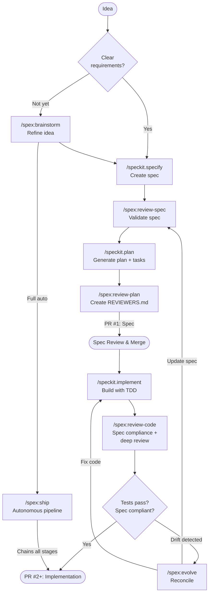

# cc-spex


[](https://github.com/obra/superpowers)
[](https://github.com/github/spec-kit)

> Extend Spec-Kit with composable traits and additional workflow commands for Claude Code.

> [!NOTE]
> This project was previously named **cc-sdd**. It has been renamed to **cc-spex** in v3.0.0 to avoid confusion with the unrelated [gotalab/cc-sdd](https://github.com/gotalab/cc-sdd) project. If you were using cc-sdd, see [Migrating from sdd](#migrating-from-sdd-v2x) below.

## Why cc-spex?

[Spec-Kit](https://github.com/github/spec-kit) is a great foundation for specification-driven development. cc-spex is a Claude Code plugin that stays as close to upstream Spec-Kit as possible while adding orthogonal features through **traits**, a composable overlay mechanism similar to aspect-oriented programming for Claude Code plugins.

Each trait injects cross-cutting behavior into Spec-Kit's existing commands without modifying them. Quality gates, git worktree isolation, parallel agent execution: these concerns live outside the core workflow. Traits let you opt into them selectively, and Spec-Kit's commands remain the same underneath.

cc-spex also adds its own commands for things Spec-Kit doesn't cover, like interactive brainstorming, spec/code drift detection, and review workflows. For hands-on work, you call each step yourself in the order that fits your situation. For full automation, `/spex:ship` chains the entire workflow from brainstorm to verification with configurable oversight.

## Workflow

The recommended workflow has two phases, each producing a pull request:

### Phase 1: Specification

Start with an idea, refine it through brainstorming, then create a formal spec and implementation plan. The output is a PR containing `spec.md`, `plan.md`, `tasks.md`, and a `REVIEWERS.md` that guides reviewers through what to look for during spec review.

```
/spex:brainstorm          # Refine the idea through dialogue
/speckit.specify           # Create formal spec
/spex:review-spec          # Validate spec quality
/speckit.plan              # Generate implementation plan + tasks
/spex:review-plan          # Validate plan, generate REVIEWERS.md
```

Open a PR with these artifacts. Reviewers use `REVIEWERS.md` as a starting point to understand the spec's scope, key decisions, and areas that need scrutiny.

### Phase 2: Implementation

After the spec PR is reviewed and merged, implementation can proceed in one or more PRs (one per logical phase is ideal). Each implementation PR updates `REVIEWERS.md` with code-specific review hints, compliance notes, and areas where the reviewer should focus.

```
/speckit.implement         # Build following the plan
/spex:review-code          # Spec compliance + deep review
/spex:verify               # Final verification
```

If spec/code drift is detected during implementation, use `/spex:evolve` to reconcile: either update the spec or fix the code, then continue.

### One-Shot: `/spex:ship`

For smaller features or solo projects, `/spex:ship` chains the entire workflow from brainstorm through verification in a single session, without intermediate PRs. It runs all nine stages autonomously with configurable oversight levels (`--ask always|smart|never`) and can optionally create a PR at the end with `--create-pr`. See [Ship Command](#ship-command) below for details.



## Quick Start

**Prerequisites:**
1. [Claude Code](https://docs.anthropic.com/en/docs/claude-code) installed
2. [Spec-Kit](https://github.com/github/spec-kit) installed (`uv tool install specify-cli --from git+https://github.com/github/spec-kit.git` or see their docs)

**Install via Marketplace (recommended):**

```bash
# Add the marketplace (once)
/plugin marketplace add rhuss/cc-rhuss-marketplace

# Install the plugin
/plugin install spex@cc-rhuss-marketplace
```

**Install from source:**

```bash
git clone https://github.com/rhuss/cc-spex.git
cd cc-spex
make install
```

**Initialize your project:**

```
/spex:init
```

This runs Spec-Kit's `specify init`, asks which traits to enable, and configures permission auto-approval. After initialization, your selected traits extend all `/speckit.*` commands.

## The Traits System

cc-spex is built around traits. Instead of wrapping Spec-Kit commands with separate `/spex:*` versions, traits modify the commands directly by appending overlay content.

### How It Works

Each trait is a collection of small `.append.md` files. When you enable a trait, cc-spex appends these files to the corresponding Spec-Kit command files. A sentinel marker (an HTML comment like `<!-- SPEX-TRAIT:superpowers -->`) prevents duplicate application. The process is idempotent: you can run it multiple times safely.

When Spec-Kit updates wipe the command files (via `specify init --force`), running `/spex:init` reapplies all enabled trait overlays from scratch.

### Available Traits

**`superpowers`** adds quality gates to Spec-Kit commands. Requires the [Superpowers](https://github.com/obra/superpowers) companion plugin to be installed alongside cc-spex:
- `/speckit.specify` gets automatic spec review after creation
- `/speckit.plan` gets spec validation before planning and consistency checks after
- `/speckit.implement` gets code review and verification gates

**`deep-review`** adds multi-perspective code review with autonomous fix capabilities. Requires `superpowers`. Benefits significantly from having the [Superpowers](https://github.com/obra/superpowers) plugin installed, which provides the quality gate infrastructure that triggers deep review automatically after implementation:
- `/spex:review-code` runs a two-stage pipeline: first spec compliance scoring, then (if compliance passes at 95%+) five specialized review agents analyze the code
- Review agents cover correctness, architecture/idioms, security, production readiness, and test quality
- Critical and Important findings trigger an autonomous fix loop (up to 3 rounds) where fixes are applied and re-reviewed
- Findings are written to `review-findings.md` and a summary is appended to `REVIEWERS.md` for human reviewers
- Optionally integrates with external tools (CodeRabbit CLI, GitHub Copilot CLI) when configured in `.specify/spex-traits.json`

**`teams`** (experimental, requires `superpowers`) adds parallel implementation via Claude Code Agent Teams. When combined with `deep-review`, the five review agents run in parallel instead of sequentially:
- `/speckit.implement` delegates to team orchestration with spec guardian review

**`worktrees`** adds git worktree isolation for feature development:
- `/speckit.specify` creates a sibling worktree for the feature branch and restores `main` in the original repo
- `/spex:worktree` lists active worktrees or cleans up merged ones

### Managing Traits

```
/spex:traits list                  # Show which traits are active
/spex:traits enable superpowers    # Enable a trait
/spex:traits disable superpowers   # Disable a trait
```

Trait configuration is stored in `.specify/spex-traits.json`, which survives Spec-Kit updates.

## Commands Reference

### Workflow Commands

These are the commands you'll use day-to-day. The `/speckit.*` commands come from Spec-Kit and are enhanced by your enabled traits.

| Command | Purpose |
|---------|---------|
| `/speckit.specify` | Define requirements and create a formal spec |
| `/speckit.plan` | Generate an implementation plan from a spec |
| `/speckit.tasks` | Create actionable tasks from a plan |
| `/speckit.implement` | Build features following the plan and tasks |
| `/speckit.constitution` | Define project-wide governance principles |
| `/speckit.clarify` | Clarify underspecified areas of a spec |
| `/speckit.analyze` | Check consistency across spec artifacts |
| `/speckit.checklist` | Generate a quality validation checklist |
| `/speckit.taskstoissues` | Convert tasks to GitHub issues |

### Spex Commands

These commands provide functionality beyond what Spec-Kit offers.

| Command | Purpose |
|---------|---------|
| `/spex:init` | Initialize Spec-Kit, select traits, configure permissions |
| `/spex:brainstorm` | Refine a rough idea into a spec through dialogue |
| `/spex:evolve` | Reconcile spec/code drift with guided resolution |
| `/spex:review-spec` | Validate a spec for soundness, completeness, and clarity |
| `/spex:review-code` | Review code against its spec for compliance |
| `/spex:review-plan` | Review a plan for feasibility and spec alignment |
| `/spex:worktree` | List active worktrees or clean up merged ones (requires `worktrees` trait) |
| `/spex:traits` | Enable, disable, or list active traits |
| `/spex:ship` | Run the full workflow autonomously (requires `superpowers` + `deep-review` traits) |
| `/spex:help` | Show a quick reference for all commands |

## Ship Command

`/spex:ship` is the autonomous full-cycle workflow that chains all stages from specification through verification. It requires both the `superpowers` and `deep-review` traits to be enabled.

```
/spex:ship [brainstorm-file] [--ask always|smart|never] [--resume] [--start-from <stage>] [--create-pr] [--no-external] [--[no-]coderabbit] [--[no-]copilot]
```

The pipeline runs nine stages in strict order:

| # | Stage | What happens |
|---|-------|-------------|
| 0 | specify | Generate spec from brainstorm document |
| 1 | clarify | Resolve spec ambiguities (up to 5 questions) |
| 2 | review-spec | Validate spec quality and structure |
| 3 | plan | Generate implementation plan with research |
| 4 | tasks | Generate dependency-ordered task breakdown |
| 5 | review-plan | Validate plan feasibility, create `REVIEWERS.md` |
| 6 | implement | Execute implementation following task plan |
| 7 | review-code | Spec compliance + deep-review agents + auto-fix loop |
| 8 | verify | Final verification (tests, hygiene, drift check) |

**Oversight levels** control how findings are handled:

| Level | Unambiguous fixes | Ambiguous fixes | Blockers |
|-------|-------------------|-----------------|----------|
| `always` | Pause for approval | Pause | Pause |
| `smart` (default) | Auto-fix | Pause | Pause |
| `never` | Auto-fix | Auto-fix | Pause |

Pipeline state is persisted to `.specify/.spex-ship-phase`, so interrupted runs can be resumed with `--resume`. Use `--start-from <stage>` to begin at a specific stage when artifacts from earlier stages already exist.

### Recommended setup with worktrees

The `worktrees` trait can interfere with `/spex:ship` because Spec-Kit's branch creation during the `specify` stage conflicts with the trait's own worktree switching. Disable the `worktrees` trait when using `/spex:ship`:

```
/spex:traits disable worktrees
```

Instead, create a worktree manually before starting the pipeline. This gives you an isolated workspace where the full pipeline can run unattended without session restarts:

```bash
# Create a worktree from main with a working name
git worktree add ../myproject-new-feature main

# Switch to it
cd ../myproject-new-feature
```

Then start your workflow there:

```
/spex:brainstorm              # Capture the idea
/spex:ship --ask smart        # Run the full pipeline
```

During the `specify` stage, Spec-Kit creates a feature-specific branch (e.g., `feature/012-auth-redesign`) and the pipeline continues on that branch through implementation and verification. Since the worktree is isolated, nothing interrupts your main workspace.

When the pipeline finishes, you can either rename the worktree directory to match the feature branch, or merge and remove it:

```bash
# Option A: Rename to match the branch
cd ..
mv myproject-new-feature myproject-auth-redesign

# Option B: Merge and clean up
cd ../myproject
git merge feature/012-auth-redesign
git worktree remove ../myproject-new-feature
```

## Deep Review

The deep-review process is a two-stage code review pipeline triggered by `/spex:review-code` when the `deep-review` trait is enabled.

**Stage 1: Spec Compliance.** The code is checked against functional and non-functional requirements from the spec. If the compliance score is below 95%, the pipeline stops and reports gaps before proceeding.

**Stage 2: Multi-Perspective Review.** Five specialized agents analyze the codebase, each focused on a distinct concern:

| Agent | Focus |
|-------|-------|
| **Correctness** | Mutation safety, shared references, logic errors, resource cleanup, null safety |
| **Architecture & Idioms** | Dead code, unnecessary complexity, duplication, misleading naming, YAGNI violations |
| **Security** | Input validation, injection risks, secret handling, authentication, RBAC scope |
| **Production Readiness** | Goroutine leaks, unbounded channels, memory patterns, observability gaps, graceful shutdown |
| **Test Quality** | Coverage gaps, weak assertions, wrong-reason passes, missing edge cases, test isolation |

When the `teams` trait is also enabled, all five agents run in parallel via Claude Code Agent Teams. Otherwise they run sequentially.

**Autonomous Fix Loop.** After all agents report their findings, Critical and Important issues are collected and fixed automatically (up to 3 rounds). Each round applies fixes and re-reviews only the modified files. The loop ends when no Critical or Important findings remain, or when the maximum rounds are reached.

**Output.** The process produces two artifacts:
- `review-findings.md` with detailed findings including severity, confidence, file/line, and resolution status
- An appended section in `REVIEWERS.md` summarizing what was found, what was fixed automatically, and what still needs human attention

## Migrating from sdd (v2.x)

If you were using the previous `sdd` plugin, follow these steps:

**1. Update the plugin:**

```bash
cd cc-spex       # (formerly cc-sdd)
git pull
make install     # automatically removes old sdd plugin and marketplace
```

**2. Migrate project config:**

Run `/spex:init` in each project. This automatically renames `.specify/sdd-traits.json` to `spex-traits.json` and `.specify/.sdd-phase` to `.spex-phase`.

**3. Update references:**

| Before (v2.x) | After (v3.x) |
|----------------|--------------|
| `/sdd:brainstorm` | `/spex:brainstorm` |
| `/sdd:review-spec` | `/spex:review-spec` |
| `/sdd:evolve` | `/spex:evolve` |
| `/sdd:init` | `/spex:init` |
| `/sdd:traits` | `/spex:traits` |
| `.specify/sdd-traits.json` | `.specify/spex-traits.json` |

All `/speckit.*` commands remain unchanged.

## Acknowledgements

cc-spex builds on two projects:

- **[Superpowers](https://github.com/obra/superpowers)** by Jesse Vincent, which provides quality gates and verification workflows for Claude Code.
- **[Spec-Kit](https://github.com/github/spec-kit)** by GitHub, which provides specification-driven development templates and the `specify` CLI.

## License

Apache License 2.0. See [LICENSE](LICENSE) for details.
