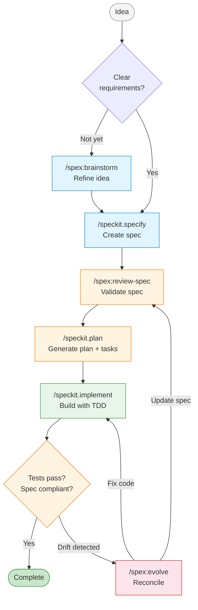

# cc-spex


[](https://github.com/obra/superpowers)
[](https://github.com/github/spec-kit)

> Extend Spec-Kit with composable traits and additional workflow commands for Claude Code.

## Why cc-spex?

[Spec-Kit](https://github.com/github/spec-kit) is a great foundation for specification-driven development. cc-spex is a Claude Code plugin that stays as close to upstream Spec-Kit as possible while adding orthogonal features through **traits**, a composable overlay mechanism similar to aspect-oriented programming for Claude Code plugins.

Each trait injects cross-cutting behavior into Spec-Kit's existing commands without modifying them. Quality gates, git worktree isolation, parallel agent execution: these concerns live outside the core workflow. Traits let you opt into them selectively, and Spec-Kit's commands remain the same underneath.

cc-spex also adds its own commands for things Spec-Kit doesn't cover, like interactive brainstorming, spec/code drift detection, and review workflows. The workflow diagram below is a guide, not an automated pipeline. You call each step yourself, in the order that fits your situation.

## Workflow



## Quick Start

**Prerequisites:**
1. [Claude Code](https://docs.anthropic.com/en/docs/claude-code) installed
2. [Spec-Kit](https://github.com/github/spec-kit) installed (`uv tool install specify-cli --from git+https://github.com/github/spec-kit.git` or see their docs)

**Install cc-spex:**

```bash
git clone https://github.com/rhuss/cc-spex.git
cd cc-spex
make install
```

**Initialize your project:**

```
/spex:init
```

This runs Spec-Kit's `specify init`, asks which traits to enable, and configures permission auto-approval. After initialization, your selected traits extend all `/speckit.*` commands.

## The Traits System

cc-spex is built around traits. Instead of wrapping Spec-Kit commands with separate `/spex:*` versions, traits modify the commands directly by appending overlay content.

### How It Works

Each trait is a collection of small `.append.md` files. When you enable a trait, cc-spex appends these files to the corresponding Spec-Kit command files. A sentinel marker (an HTML comment like `<!-- SDD-TRAIT:superpowers -->`) prevents duplicate application. The process is idempotent: you can run it multiple times safely.

When Spec-Kit updates wipe the command files (via `specify init --force`), running `/spex:init` reapplies all enabled trait overlays from scratch.

### Available Traits

**`superpowers`** adds quality gates to Spec-Kit commands:
- `/speckit.specify` gets automatic spec review after creation
- `/speckit.plan` gets spec validation before planning and consistency checks after
- `/speckit.implement` gets code review and verification gates

**`teams`** (experimental, requires `superpowers`) adds parallel implementation via Claude Code Agent Teams:
- `/speckit.implement` delegates to team orchestration with spec guardian review

**`worktrees`** adds git worktree isolation for feature development:
- `/speckit.specify` creates a sibling worktree for the feature branch and restores `main` in the original repo
- `/spex:worktree` lists active worktrees or cleans up merged ones

### Managing Traits

```
/spex:traits list                  # Show which traits are active
/spex:traits enable superpowers    # Enable a trait
/spex:traits disable superpowers   # Disable a trait
```

Trait configuration is stored in `.specify/spex-traits.json`, which survives Spec-Kit updates.

## Commands Reference

### Workflow Commands

These are the commands you'll use day-to-day. The `/speckit.*` commands come from Spec-Kit and are enhanced by your enabled traits.

| Command | Purpose |
|---------|---------|
| `/speckit.specify` | Define requirements and create a formal spec |
| `/speckit.plan` | Generate an implementation plan from a spec |
| `/speckit.tasks` | Create actionable tasks from a plan |
| `/speckit.implement` | Build features following the plan and tasks |
| `/speckit.constitution` | Define project-wide governance principles |
| `/speckit.clarify` | Clarify underspecified areas of a spec |
| `/speckit.analyze` | Check consistency across spec artifacts |
| `/speckit.checklist` | Generate a quality validation checklist |
| `/speckit.taskstoissues` | Convert tasks to GitHub issues |

### SPEX Commands

These commands provide functionality beyond what Spec-Kit offers.

| Command | Purpose |
|---------|---------|
| `/spex:init` | Initialize Spec-Kit, select traits, configure permissions |
| `/spex:brainstorm` | Refine a rough idea into a spec through dialogue |
| `/spex:evolve` | Reconcile spec/code drift with guided resolution |
| `/spex:review-spec` | Validate a spec for soundness, completeness, and clarity |
| `/spex:review-code` | Review code against its spec for compliance |
| `/spex:review-plan` | Review a plan for feasibility and spec alignment |
| `/spex:worktree` | List active worktrees or clean up merged ones (requires `worktrees` trait) |
| `/spex:traits` | Enable, disable, or list active traits |
| `/spex:help` | Show a quick reference for all commands |

## Acknowledgements

cc-spex builds on two projects:

- **[Superpowers](https://github.com/obra/superpowers)** by Jesse Vincent, which provides quality gates and verification workflows for Claude Code.
- **[Spec-Kit](https://github.com/github/spec-kit)** by GitHub, which provides specification-driven development templates and the `specify` CLI.

## License

MIT License. See [LICENSE](LICENSE) for details.
