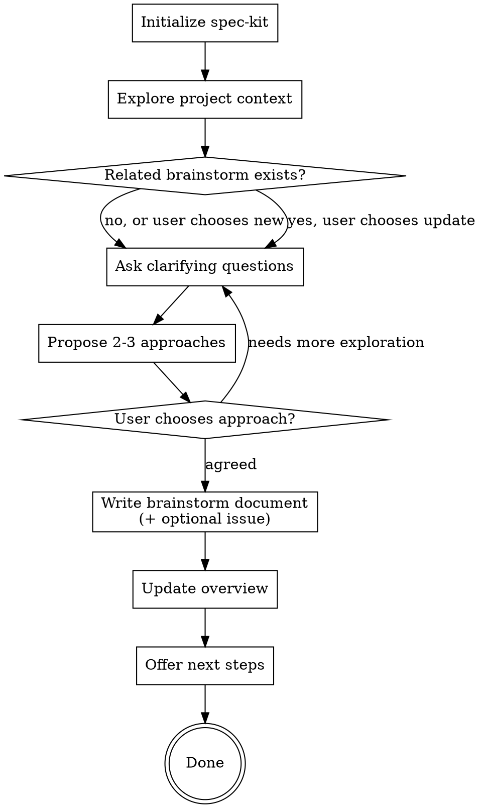

# Brainstorming Ideas Into Specifications

Help turn rough ideas into clear, agreed-upon feature descriptions through natural collaborative dialogue. The output is a brainstorm document capturing the problem, approaches considered, and the decision, ready for formal specification.

**Key Principle:** Brainstorming explores WHAT to build and WHY. The formal spec (via `/speckit-specify`) and implementation planning come after.

**Idea Inbox:** On startup, check `brainstorm/idea-inbox.md` for accumulated review ideas and offer them as brainstorm seeds (see step 3). After creating a brainstorm document from inbox items, remove consumed entries (see step 8). When invoked after a review discussion that contained deferred-idea signals ("out of scope", "worth considering later", "design tension", "follow-up", "for a future PR"), also mention that ideas can be added to the inbox manually.

<HARD-GATE>
Do NOT invoke any implementation skill, write any code, scaffold any project, create spec files, or take any implementation action during brainstorming. Brainstorming ends with a decision and a brainstorm document, not a spec.
</HARD-GATE>

<HARD-GATE>
## Command Namespace: Use the correct prefixes

spex extension commands use the `speckit-spex-*` prefix (e.g., `/speckit-spex-brainstorm`).
speckit core commands use the `speckit-` prefix (e.g., `/speckit-specify`, `/speckit-plan`).

Commands like `/spex:specify`, `/spex:plan`, `/spex:implement`, `/spex:tasks` DO NOT EXIST.
</HARD-GATE>

## Checklist

You MUST create a task for each of these items and complete them in order:

1. **Initialize spec-kit** - ensure specify CLI and project are set up
2. **Explore project context** - check files, specs, constitution, recent commits
3. **Check idea inbox** - check `brainstorm/idea-inbox.md` for accumulated ideas from reviews, offer as brainstorm seeds
4. **Check for related brainstorms** - scan `brainstorm/` for existing docs on similar topics, offer to update or create new
5. **Ask clarifying questions** - one at a time, understand purpose/constraints/success criteria
6. **Propose 2-3 approaches** - with trade-offs and your recommendation
7. **Reach agreement** - confirm the chosen approach and scope with the user
8. **Write brainstorm document** - persist session summary to `brainstorm/NN-topic-slug.md`, optionally create GitHub/GitLab issue. If seeded from inbox items, remove consumed entries from `brainstorm/idea-inbox.md`
9. **Update overview** - create or refresh `brainstorm/00-overview.md` with index, open threads, parked ideas
10. **Transition** - offer next steps

## Process Flow



## Prerequisites

Spec-kit must be initialized before brainstorming. If `.specify/` directory does not exist, tell the user to run `/spex:init` first and stop.

## The Process

### Understanding the idea

**Check context first:**
- Review existing specs (if any) in `specs/` directory
- Check for constitution (`.specify/memory/constitution.md`)
- Review recent commits to understand project state
- Look for related features or patterns
- Scan `brainstorm/` directory for existing brainstorm documents (triggers revisit detection, see step 4 in checklist)
- Check if `brainstorm/idea-inbox.md` exists and has entries (triggers inbox seed offering, see step 3 in checklist)

**Check idea inbox (step 3):**

After exploring project context, check if `brainstorm/idea-inbox.md` exists and contains entries:

1. If the file does not exist or is empty (only the `# Idea Inbox` header), skip — proceed with normal flow.
2. If entries exist, parse them by `### ` headings. Each entry has metadata fields (Source, Date, Reference, Summary) and a blockquote context snippet.
3. Group entries by theme slug (the `### ` heading text).
4. Present the inbox items to the user grouped by theme:

   - header: "Ideas from code reviews"
   - multiSelect: true
   - Each theme becomes an option with the theme slug as label and the entry's Summary as description. If multiple entries share the same theme slug, combine their summaries.
   - Include a "Start fresh" option to skip all inbox items

5. If the user selects one or more themes:
   - Use the selected entries' Summary and Context fields to pre-fill the problem framing for the brainstorm session
   - Track which theme slugs were selected (needed for consumption in step 8)
   - Skip the normal "what do you want to brainstorm?" question — the inbox provides the seed

6. If the user selects "Start fresh" or no items:
   - Proceed with the normal brainstorm flow unchanged
   - Inbox items remain untouched

**Assess scope before deep-diving:**
- Before asking detailed questions, assess scope: if the request describes multiple independent subsystems (e.g., "build a platform with chat, file storage, billing, and analytics"), flag this immediately. Don't spend questions refining details of a project that needs to be decomposed first.
- If the project is too large for a single spec, help the user decompose into sub-projects: what are the independent pieces, how do they relate, what order should they be built? Then brainstorm the first sub-project through the normal design flow. Each sub-project gets its own spec, plan, and implementation cycle.

**Ask questions to refine:**
- For appropriately-scoped projects, ask questions one at a time to refine the idea
- Only one question per message. If a topic needs more exploration, break it into multiple questions
- Prefer multiple choice when possible, but open-ended is fine too
- Focus on: purpose, constraints, success criteria, edge cases
- Identify dependencies and integrations

**Remember:** You're exploring WHAT needs to happen, not HOW it will be implemented.

### Exploring approaches

**Propose 2-3 different approaches:**
- Present options conversationally with trade-offs
- Lead with your recommended option
- Explain reasoning clearly
- Consider: complexity, maintainability, user impact

**Questions to explore:**
- What are the core requirements vs. nice-to-have?
- What are the error cases and edge conditions?
- How does this integrate with existing features?
- What are the success criteria?

### Reaching agreement

Once the user picks an approach, confirm the scope:
- Summarize what's in scope and out of scope
- Confirm key requirements and constraints
- Note any open questions that the spec phase should resolve

This is the decision point. The brainstorm document captures this agreement.

### Transition: next steps

After the brainstorm document is written and overview updated, offer the user a choice of how to proceed:

Present options to the user:
- header: "Next steps"
- multiSelect: false
- Options:
  - "Specify step-by-step (/speckit-specify)": "Create a formal spec interactively, then plan and implement in separate steps"
  - "Ship autonomously (/speckit-spex-ship)": "Run the full pipeline (specify, plan, implement, review) with configurable oversight. Best for small to mid-sized features."
  - "Done for now": "Stop here. The brainstorm document is saved for later."

If the user chooses "Specify step-by-step": invoke `/speckit-specify` with the brainstorm document as context.

If the user chooses "Ship autonomously": invoke `/speckit-spex-ship` with the brainstorm document path as argument.

If the user chooses "Done for now": end the session.

## Brainstorm Document Structure

Each brainstorm session produces a structured summary document. The document uses this format:

```markdown
# Brainstorm: [Topic]

**Date:** YYYY-MM-DD
**Status:** active | parked | abandoned | spec-created
**Issue:** <URL> *(optional, present when a GitHub/GitLab issue was created)*

## Problem Framing
[What problem is being explored and why it matters]

## Approaches Considered

### A: [Approach Name]
- Pros: ...
- Cons: ...

### B: [Approach Name]
- Pros: ...
- Cons: ...

## Decision
[What was chosen and why, or "Parked: [reason]" if no decision was reached]

## Key Requirements
[Core requirements agreed during brainstorming, to feed into the spec]

## Open Questions
- [Unresolved question that the spec phase should address]
```

**Status values:**
- `active` - session completed, idea is being pursued
- `parked` - session stopped intentionally, idea may be revisited
- `abandoned` - session stopped, idea is not being pursued
- `spec-created` - a spec was created from this brainstorm (include spec path)

## Overview Document Structure

The `brainstorm/00-overview.md` file provides a navigable index of all brainstorm sessions:

```markdown
# Brainstorm Overview

Last updated: YYYY-MM-DD

## Sessions

| # | Date | Topic | Status | Spec | Issue |
|---|------|-------|--------|------|-------|
| 01 | YYYY-MM-DD | topic-slug | spec-created | 0003 | - |
| 02 | YYYY-MM-DD | topic-slug | active | - | [#42](url) |
| 03 | YYYY-MM-DD | topic-slug | parked | - | - |

## Open Threads
- [Thread description] (from #NN)
- [Thread description] (from #NN)

## Parked Ideas
- [Idea description] (#NN)
  Reason: [why parked]
```

## Revisit Detection

**When:** During step 3 of the checklist (after exploring project context).

**How:**
1. Check if `brainstorm/` directory exists. If not, skip (no prior brainstorms).
2. List all `NN-*.md` files in `brainstorm/` (excluding `00-overview.md`).
3. Extract topic slugs from filenames (the part after the number prefix).
4. Compare the current brainstorm topic against existing slugs using keyword overlap.
5. If a related brainstorm document is found, present options to the user:
   - **Option A: "Create new document"** - session produces a new numbered file
   - **Option B: "Update existing"** - session appends a new dated section to the existing document

**If "Update existing" is chosen:**
At session end, instead of creating a new file, append a new section to the existing document:

```markdown

---

## Revisit: YYYY-MM-DD

### Updated Problem Framing
[How understanding has evolved]

### New Approaches Considered
...

### Updated Decision
...

### Open Threads
- [New or updated threads]
```

Then update the overview to reflect any status or thread changes.

## Writing the Brainstorm Document

**When:** Step 7 of the checklist (after reaching agreement).

You MUST write the brainstorm document at session end. This step is NOT optional.

**Procedure:**

1. **Determine output directory** (spex-detach aware):
   ```bash
   BRAINSTORM_DIR="brainstorm"

   # Check if spex-detach is enabled and has an archive path
   DETACH_SCRIPT="$(find ~/.claude -name 'spex-detach.sh' 2>/dev/null | head -1)"
   if [ -n "$DETACH_SCRIPT" ] && [ -x "$DETACH_SCRIPT" ] && "$DETACH_SCRIPT" is-enabled 2>/dev/null; then
     DETACH_CONFIG=".specify/extensions/spex-detach/spex-detach-config.yml"
     ARCHIVE_PATH=$(yq -r '.archive.path // empty' "$DETACH_CONFIG" 2>/dev/null)
     if [ -n "$ARCHIVE_PATH" ] && [ -d "$ARCHIVE_PATH" ]; then
       BRAINSTORM_DIR="$ARCHIVE_PATH/brainstorm"
       echo "spex-detach: writing brainstorm to project-specs repo at $BRAINSTORM_DIR"
     fi
   fi

   mkdir -p "$BRAINSTORM_DIR"
   ```

   Use `$BRAINSTORM_DIR` instead of `brainstorm/` for all subsequent file operations in this section.

2. **Detect next number** by scanning existing files:
   ```bash
   ls brainstorm/[0-9][0-9]-*.md 2>/dev/null
   ```
   Use `max_existing_number + 1`. If no files exist, start at 01. Do NOT gap-fill (if 01 and 03 exist, next is 04).

3. **Generate topic slug**: Derive from the brainstorm topic. Lowercase, hyphens, 2-4 words.
   Example: "user authentication system" becomes `auth-system`

4. **Determine status**:
   - If the user chose to park the idea: `parked`
   - If the user abandoned early: `abandoned`
   - Otherwise: `active`

5. **Write the document** using the Brainstorm Document Structure defined above.

6. **Offer issue creation** (only for `active` status, skip for parked/abandoned):

   Detect platform from git remote:
   ```bash
   REMOTE_URL=$(git remote get-url origin 2>/dev/null || true)
   ```

   Determine platform:
   - If URL contains `github.com`: PLATFORM=github, CLI=`gh`
   - If URL contains `gitlab.com` or `gitlab.`: PLATFORM=gitlab, CLI=`glab`
   - Otherwise: skip issue creation (no prompt shown)

   If a platform was detected, verify the CLI is available:
   ```bash
   command -v $CLI >/dev/null 2>&1
   ```

   Read the brainstorm label from the collab extension config (if it exists):
   ```bash
   COLLAB_CONFIG=".specify/extensions/spex-collab/collab-config.yml"
   BRAINSTORM_LABEL=$(yq -r '.labels.brainstorm // "brainstorm"' "$COLLAB_CONFIG" 2>/dev/null)
   BRAINSTORM_LABEL=${BRAINSTORM_LABEL:-brainstorm}
   ```

   If the CLI is available, present options to the user:
   - header: "Create issue?"
   - multiSelect: false
   - Options:
     - **"Yes, create $PLATFORM issue"**: "Create an issue with the brainstorm content on $PLATFORM"
     - **"No, local document only"**: "Keep only the local brainstorm file"

   If the user chooses yes:

   Handle fork detection (prefer `upstream` remote for issue creation):
   ```bash
   REPO_FLAG=""
   if git remote | grep -qx upstream 2>/dev/null; then
     UPSTREAM_REPO=$(git remote get-url upstream 2>/dev/null | sed 's|.*github\.com[:/]||; s|\.git$||')
     [ -n "$UPSTREAM_REPO" ] && REPO_FLAG="--repo $UPSTREAM_REPO"
   fi
   ```

   Create the issue (the body is the brainstorm document content):

   For GitHub:
   ```bash
   ISSUE_URL=$(gh issue create $REPO_FLAG \
     --title "Brainstorm: [topic]" \
     --label "$BRAINSTORM_LABEL" \
     --body "$ISSUE_BODY" 2>&1)
   ```

   For GitLab:
   ```bash
   ISSUE_URL=$(glab issue create \
     --title "Brainstorm: [topic]" \
     --label "$BRAINSTORM_LABEL" \
     --description "$ISSUE_BODY" 2>&1)
   ```

   If label creation fails (label does not exist), retry without `--label` and warn.

   On success, append `**Issue:** <ISSUE_URL>` to the brainstorm document header (after the Status line) using the Edit tool.

7. **Remove consumed inbox entries** (only if the session was seeded from inbox items AND the brainstorm document status is `active`):

   If the brainstorm session was seeded from one or more inbox items (selected in step 3 of the checklist) AND the brainstorm document was written with status `active` (a decision was reached), remove the consumed entries from `brainstorm/idea-inbox.md`. If the session was `parked` or `abandoned`, leave inbox items untouched — the idea was not fully explored and should remain available for future brainstorming.

   - For each consumed theme slug, use the Edit tool to remove the `### <theme-slug>` heading and its entire content block (all lines from the heading through to the next `### ` heading or end of file).
   - If all entries are consumed, leave the file with just the `# Idea Inbox` header and description line.
   - If only some entries are consumed, leave the remaining entries intact.
   - Commit the inbox update together with the brainstorm document.

   If the session was NOT seeded from inbox items (user chose "Start fresh" or inbox was empty), skip this step.

8. **Commit the brainstorm document**:
   ```bash
   git add brainstorm/NN-topic-slug.md
   # Also stage inbox changes if entries were consumed
   [ -f brainstorm/idea-inbox.md ] && git add brainstorm/idea-inbox.md
   git commit -m "Add brainstorm: [topic]

   Assisted-By: 🤖 Claude Code"
   ```

## Updating the Overview

**When:** Step 9 of the checklist (immediately after writing the brainstorm document).

You MUST update the overview after every brainstorm document write or update. This step is NOT optional.

**Procedure:**

1. **If `brainstorm/00-overview.md` does not exist**, create it.
   If `brainstorm/` exists but `00-overview.md` is missing, regenerate it from all existing documents.

2. **Always regenerate by scanning all documents** (idempotent full rebuild):
   - List all `NN-*.md` files in `brainstorm/` (excluding `00-overview.md`)
   - For each file, extract: number, date, status, spec reference, issue URL (from header metadata)
   - For each file, extract all items under `## Open Questions`
   - For each file with status `parked`, collect the idea and reason

3. **Build the overview** using the Overview Document Structure defined above:
   - Sessions table: one row per document, sorted by number (include Issue column, use `-` when no issue exists)
   - Open Threads: aggregated from all documents, tagged with source `(from #NN)`
   - Parked Ideas: collected from all `parked` documents

4. **Write `brainstorm/00-overview.md`** with the rebuilt content.

5. **Commit the overview update**:
   ```bash
   git add brainstorm/00-overview.md
   git commit -m "Update brainstorm overview

   Assisted-By: 🤖 Claude Code"
   ```

## Incomplete Session Handling

**When:** The user stops the brainstorm before reaching agreement.

**Zero-interaction guard:** If the session had no meaningful interaction (no approaches explored, no clarifying questions answered beyond the initial topic), do NOT prompt to save. Simply end the session without creating any artifacts.

**For sessions with meaningful interaction** (approaches were discussed, questions were answered):

Present to the user: **"Save this brainstorm session?"**

- **Option A: "Save as parked"** - Write the document with status `parked`, update overview
- **Option B: "Save as abandoned"** - Write the document with status `abandoned`, update overview
- **Option C: "Discard"** - Do not create any brainstorm document, do not update overview

If the user chooses to save, follow the "Writing the Brainstorm Document" and "Updating the Overview" procedures above.

## Key Principles

- **One question at a time** - Don't overwhelm with multiple questions
- **Multiple choice preferred** - Easier to answer than open-ended when possible
- **YAGNI ruthlessly** - Remove unnecessary features from all specs
- **Explore alternatives** - Always propose 2-3 approaches before settling
- **Be flexible** - Go back and clarify when something doesn't make sense
- **Separate WHAT from HOW** - Focus on requirements and outcomes, not implementation
- **Brainstorm, don't specify** - The formal spec comes later via `/speckit-specify` or `/speckit-spex-ship`

## Common Pitfalls

**Don't:**
- Write spec files during brainstorming
- Include implementation details ("use Redis for caching")
- Run review gates (that's for the specify phase)
- Skip exploring alternatives
- Rush past clarifying questions
- Invoke implementation skills

**Do:**
- Focus on requirements and behavior
- Specify WHAT, defer HOW
- Explore multiple approaches
- Capture the decision and reasoning
- Note open questions for the spec phase
- Write the brainstorm document

## Example Flow

```
User: I want to add a comment system to the blog

You: I'm using speckit-spex-brainstorm to refine this idea.

Let me understand the context first...
[Reviews existing code and specs]

For the comment system, what level of features do you want?

A) Basic - Name, email, comment text only
B) Standard - Above + threading/replies
C) Advanced - Above + reactions, editing, moderation
D) Full - Above + notifications, mentions, markdown

User: B - Standard with threading

You: Great. For threading, should replies be:

A) Unlimited depth (comments on comments on comments...)
B) One level only (reply to top-level comments)
C) Two levels (reply and one nested level)

[... conversation continues, approaches explored ...]

You: Based on our discussion, here's what we've agreed on:

- Standard comment system with one level of threading
- Comments require name, email, and text
- Newest first, replies nested under parent
- Markdown support for comment text
- No moderation in first version (out of scope)

I'll save this as a brainstorm document. How would you like to proceed?

A) Specify step-by-step (/speckit-specify)
B) Ship autonomously (/speckit-spex-ship)
C) Done for now
```
